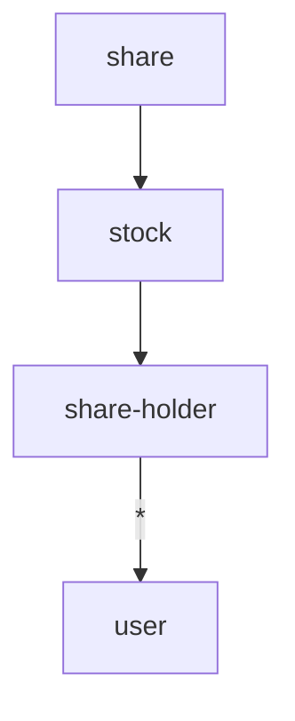

# Churras da Trica

An app to schedule brazilian barbecues. The whole app treats the event as a generic vanue like stocks on the stock market in which peers can buy shares, participate on those ventures, and, in the case of this app, which happens to only support one type of venture; Barbecue Parties.

## Software Specification Document

###  Type Fact Graph¹



Caption: 
- An arrow always points towards the predecessor.
- "?" means zero or one predecessor.
- "\*" means zero or more predecessor.
- The entity at the tail of an arrow is always of cardinality "n".
- The successor captures the predecessors, therefore, immutable. 
- The label always refer to the predecessor.


### Facts ¹

```fsharp
fact Stock {
      ipoDate: datetime
      description : string
      createdAt: DateTime
      notes: string*     
}

fact Share {
  value: decimal
  owner: ShareHolder
}

fact ShareHolder {
  user: User
}

fact User {
  username: string
  password: SecureString
}
```

Immutable records of historical events.
You cannot update or destroy a Fact, only create new ones
To change a system you need to introduce new facts
Consists of two elements: fields and predecessors.

When dealing with facts, be aware of:
- Each location has it's own facts
- Locations exchange facts
- Eventual consistency is reach between locations
- Decisions are based on local history

### Queries ¹


## How to run

```bash
dotnet run
```

## References
1. Michael L. Perry, ed. (2020) The Art of Immutable Architecture: Theory and Practice of Data Management in Distributed Systems
